## Statistiksoftware

Wir verwenden für statistische Berechnungen die freie Software [jamovi](http://www.jamovi.org). jamovi ist eine grafische Benutzerschnittstelle zu [R](https://www.r-project.org/), einer freien Sofwareumgebung für statistische Berechnungen, welche in vielen Bereichen der Wissenschaft und Wirtschaft eingesetzt wird. Installationsanweisungen für jamovi für die gängigen Betriebssysteme sind auf der jamovi Webseite zu finden. Es empfiehlt sich jeweils das Release **solid** zu verwenden, welches in der Regel gut getestet ist und wenig Fehlfunktionen aufweisen sollte. jamovi stellt die für die meisten Anwendungen im BSc Statistikkurs genügend Funktionalitäten bereit. Für fortgeschrittene Anwendungen ist es empfehlenswert direkt mit Syntax in R zu arbeiten. Um diese Arbeit zu erleichtern gibt es mit [RStudio](https://posit.co/downloads) eine hilfreiche integrierte Entwicklungsumgebung (IDE - integrated development environment).

Folgend finden sich einige hilfreiche Ressourcen für weitergehende Informationen rund um R für statistische Berechnungen.

### Online

- [jamovi](http://www.jamovi.org) - jamovi Projekt
- [R](https://www.r-project.org/) - Offizielle Homepage des R-Projekts
- [R/RStudio Install](https://www.geeksforgeeks.org/r-language/how-to-install-r-studio-on-windows-and-linux/) - Tutorial Installation R und RStudio
- [R Tutorial](https://www.geeksforgeeks.org/r-language/r-tutorial/) - R Tutorial
- [jamovi Video Tutorials](https://www.regorz-statistik.de/inhalte/jamovi_tutorials.html)

### Bücher

- A. Field, J. Miles und Z. Field, Discovering Statistics using R. London: SAGE Publications Ltd., 2012.
- H. Wickham und G. Grolemund, R for Data Science. O’Reilly UK Ltd., 2017. (freies E-Book auf [https://r4ds.hadley.nz/](https://r4ds.hadley.nz/)
- Danielle J. Navarro and David R. Foxcroft, Learning Statistics with jamovi: A Tutorial for Beginners in Statistical Analysis. Cambridge, UK: Open Book Publishers, 2025,  [https://doi.org/10.11647/OBP.0333](https://doi.org/10.11647/OBP.0333)

## jamovi Basics

Wir verwenden im Folgenden den Datensatz <a href="../data/KennzahlenKoerpergroesse_M_F.csv" download>KennzahlenKoerpergroesse.csv</a>.

### Gestaltung von Tabellen

- Für die Arbeit in R ist das Long Table Format mit Gruppierungsvariablen (z.B. Geschlecht) zu bevorzugen @fig-tablong.
- Wird mit dem Wide Table Format @fig-tabwide gearbeitet ist viel mehr Formatierungsaufwand für die Tabellen nötig.

::: {#fig-tables layout-ncol=2}

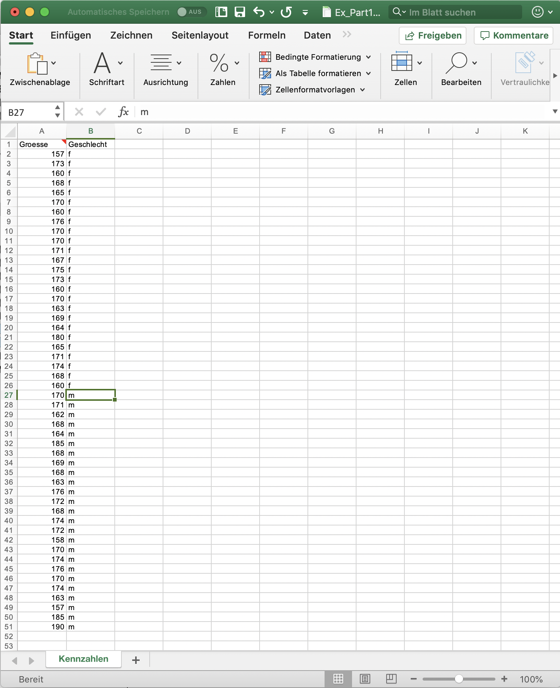{#fig-tablong}

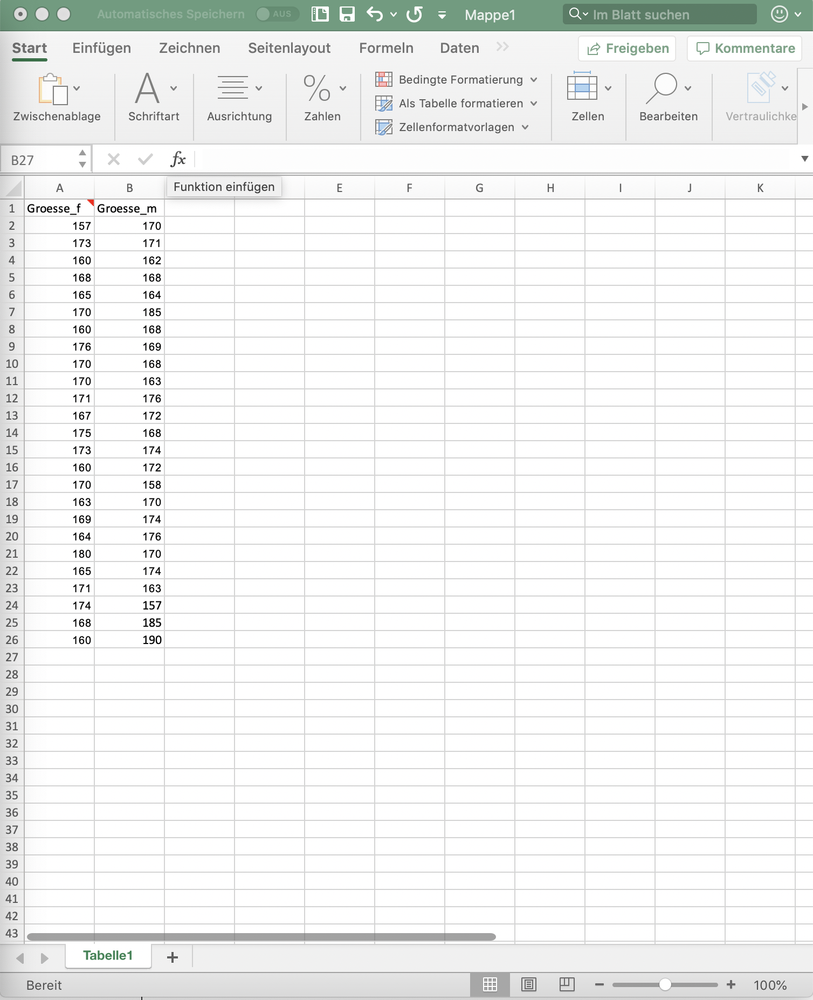{#fig-tabwide}

Gestaltung von Tabellen
:::

### Datenhandhabung in jamovi

- R und jamovi bieten grundsätzlich die Möglichkeit Daten aus diversen Quellen zu importieren (Text, Excel, Libreoffice Calc, Datenbanken, Formate anderer Statistikprogramme wie z.B. SPSS).
- Für jamovi wird optimalerweise mit kommagetrennten Textdateien (`.csv`) gearbeitet:
  - Tabelle in Excel oder Libreoffice Calc gestalten
  - `Datei` > `Speichern unter...`
  - als `.csv` Datei mit UTF-8 Encoding abspeichern.
- jamovi kann auch direkt aus Tabellenkalkulationsprogrammen wie Excel (`.xlsx`) oder Libreoffice Calc (`.ods`) importieren. Je nach dem geht aber die Erkennung des Skalenniveaus weniger gut als wenn man von `.csv` importiert.

### Datenimport

- jamovi öffnen und anschliessend `File` (drei horizontale Striche) > `Open` klicken und die Datei auswählen die geöffnet werden soll.
- Anschliessend ist den Spalten ein passendes Skalenniveau zuzuweisen (Continous, Ordinal, Nominal). Menu ist per Doppelklick auf die Spaltenüberschrift zu öffnen.

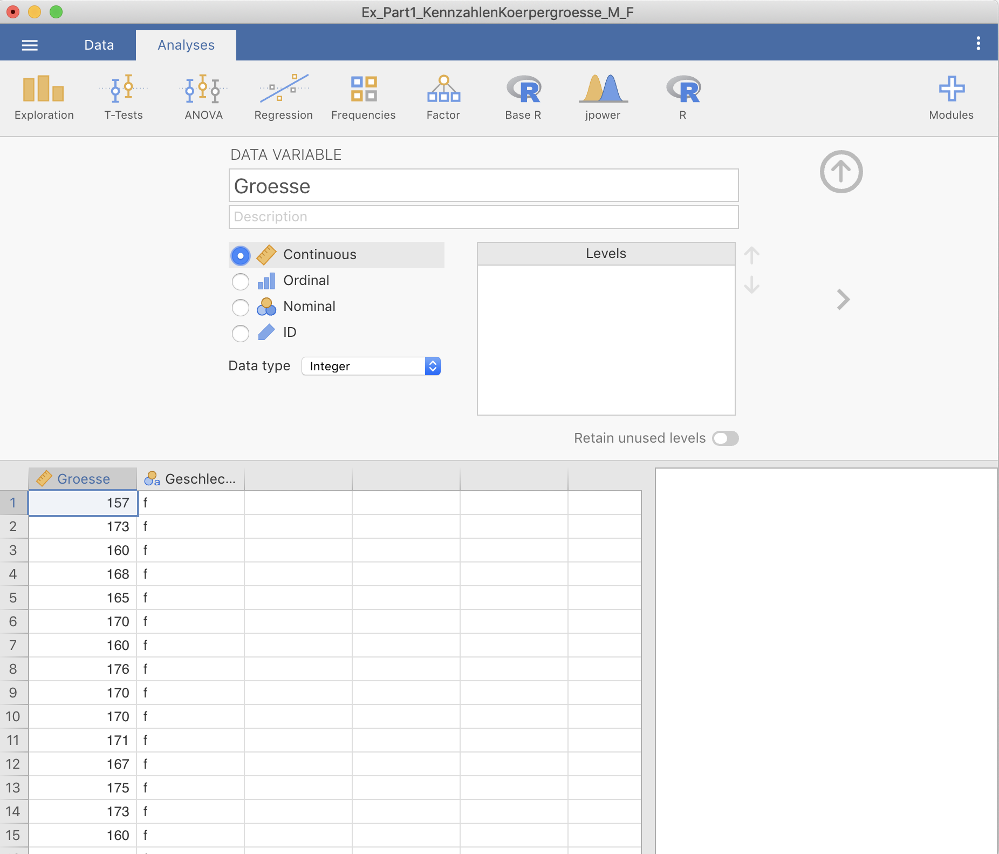{fig-align="center" width=60%}

### Deskriptive Statistik in jamovi

- `Exploration` > `Descriptives` klicken
- Anschliessend muss ausgewählt von welcher Variablen die deskriptive Statistik berechnet werden soll. Optional kann im vorliegenden Beispiel der Körpergrösse mit `Split by` gleich nach Geschlecht getrennt werden (Vorteil der Gruppierungsvariablen!)
- Die Felder `Statistics` und `Plots` können durch Klicken aufgeklappt und entsprechende Optionen ausgewählt werden.
- Die Analyse kann via `File` > `Save` als jamovi (`.omv`) Datei abgespeichert und bei Bedarf wieder geöffnet werden.
- Die Resultate können via `File` > `Export` auch direkt in ein PDF oder in HTML exportiert werden.
- Tabellen und Grafiken können via Copy-Paste (rechte Maustaste) in Textverarbeitungsprogramme (z.B. Word, Libreoffice Writer) übernommen werden.

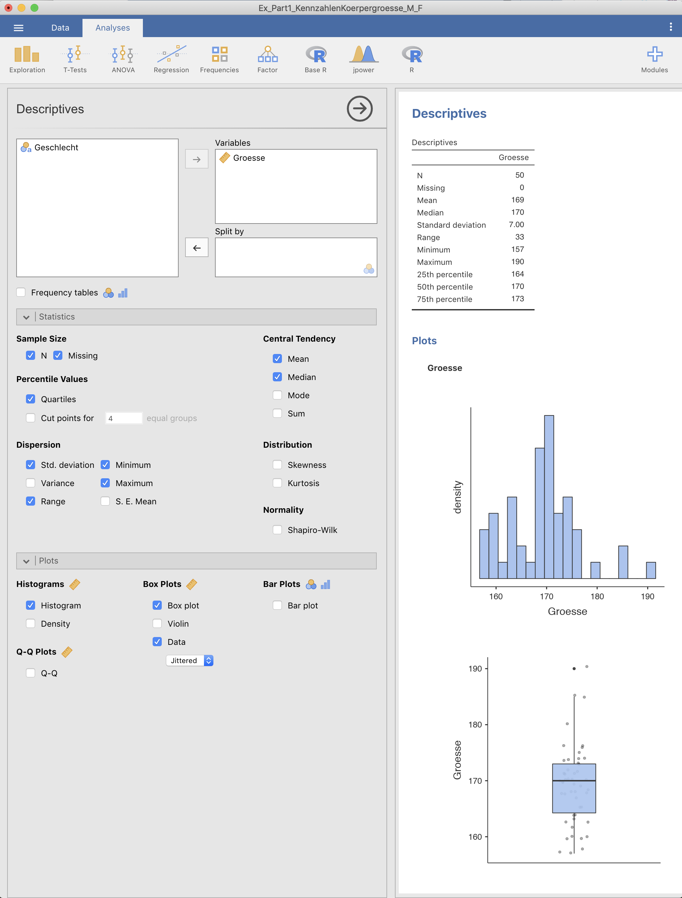{fig-align="center" width=60%}

### Aufgabe 1

::: {.panel-tabset}

### Aufgabe

Benutze den Datensatz <a href="../data/KennzahlenKoerpergroesse_M_F.csv" download>KennzahlenKoerpergroesse.csv</a>

1. Finde dich in jamovi zurecht und reproduziere die in den vorherigen Abschnitten gezeigten Schritte.
2. Analysiere die Daten getrennt nach Männern und Frauen in jamovi mithilfe der deskriptiven Statistik. Nutze dafür in jamovi die Variable `Geschlecht` als Split-by-Variable.
3. Speichere deine Analyse als `*.omv` Datei.
4. Kopiere eine Tabelle und eine Grafik in dein gewohntes Textverarbeitungsprogramm (z.B. Word).

### Lösung

<a href="../solutions/BSc_WS1_IntroJ_Ex1_sol.omv" download>BSc_WS1_IntroJ_Ex1_sol.omv</a>

### Codebook

- `Groesse`: Körpergrösse in cm
- `Geschlecht`: Geschlecht (f = female, m = male)
- `Geschlecht_code`: Geschlecht (1 = female, 2 = male)

:::

### Aufgabe 2

::: {.panel-tabset}

### Aufgabe

Bringe die Daten ins Wide-Format (separate Spalten für Männer und Frauen) und importiere sie in jamovi. Erstelle erneut deskriptive Statistiken für die Männer und die Frauen. Welche Unterschiede im Vergleich mit dem Long-Table Format stellst du fest?

### Lösung

- Libreoffice/Excel Tabelle: <a href="../solutions/BSc_WS1_IntroJ_Ex2_sol.ods" download>BSc_WS1_IntroJ_Ex2_sol.ods</a>
- .csv Datei: <a href="../data/KennzahlenKoerpergroesse_M_F_wide.csv" download>KennzahlenKoerpergroesse_M_F_wide.csv</a>
- Lösung jamovi: <a href="../solutions/BSc_WS1_IntroJ_Ex2_sol.omv" download>BSc_WS1_IntroJ_Ex2_sol.omv</a>

Wenn man mit dem Wide Table Format arbeitet, resultieren zwei separate Variablen (`Groesse_m` und `Groesse_f`) und die Gruppierungsvariable `Geschlecht` entfällt. Das Geschlecht ist nun in den Variablennamen mit dem Suffix `_m/_f` codiert. Die Folge davon ist, dass die Boxplots nicht ins gleiche Diagramm gezeichnet werden. Das erschwert die Vergleichbarkeit und sollte vermieden werden.

### Codebook

- `Groesse_m`: Körpergrösse in cm der Männer
- `Groesse_f`: Körpergrösse in cm der Frauen
:::

## jamovi Advanced

Wir verwenden im Folgenden wiederum den Datensatz <a href="../data/KennzahlenKoerpergroesse_M_F.csv" download>KennzahlenKoerpergroesse.csv</a>.

### Codieren - Levels neue Werte zuweisen

- Oftmals sind Variablen codiert. D.h. weiblich entspricht z.B. der Zahl ein und männlich der Zahl zwei.
- Zu besseren Interpretation macht es Sinn das Geschlecht den vorhandenen Levels explizit zuzuordnen.
- Data > Variable auswählen > Bei Levels neue Bezeichnung eingeben.

::: {#fig-tables layout-ncol=2}

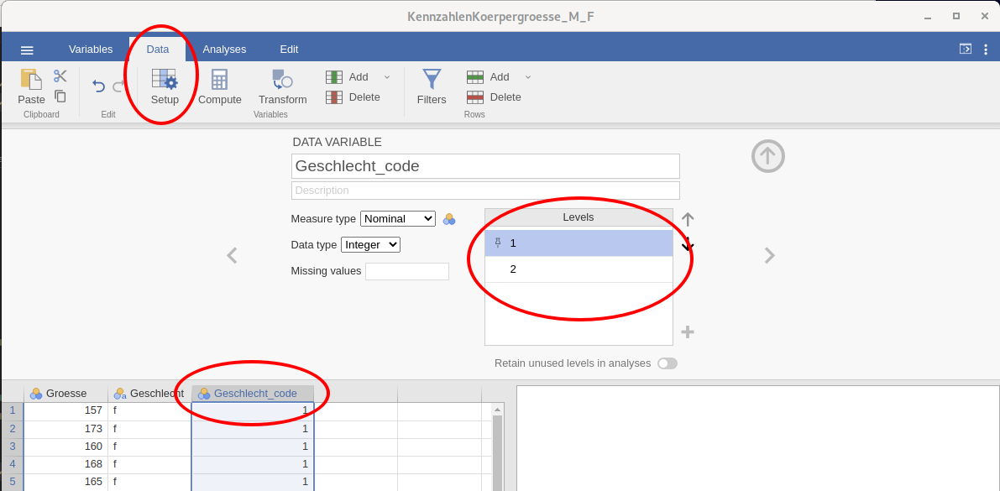{#fig-recode1}

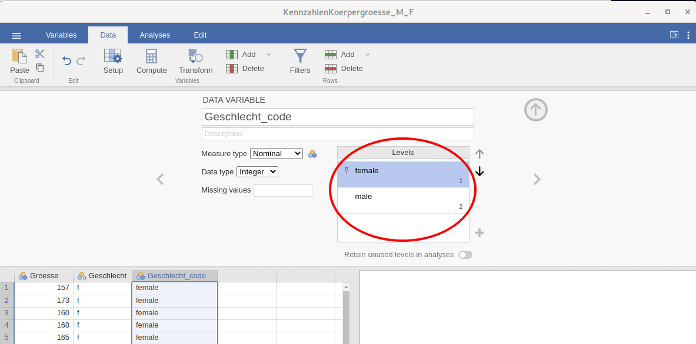{#fig-recode2}

Variablen umcodieren
:::

### Berechnen - Neue Werte generieren

- Man will anhand von vorhandenen Daten eine neue Variable berechnen.
- Im Datensatz mit der Körpergrösse, z.B. Umrechnen in die Einheit Meter.
- Data > Compute klicken. Variablennamen vergeben und Berechnungsformel eingeben. Durch Klicken aufs Formelzeichen können mathematische Operationen aufgerufen werden.

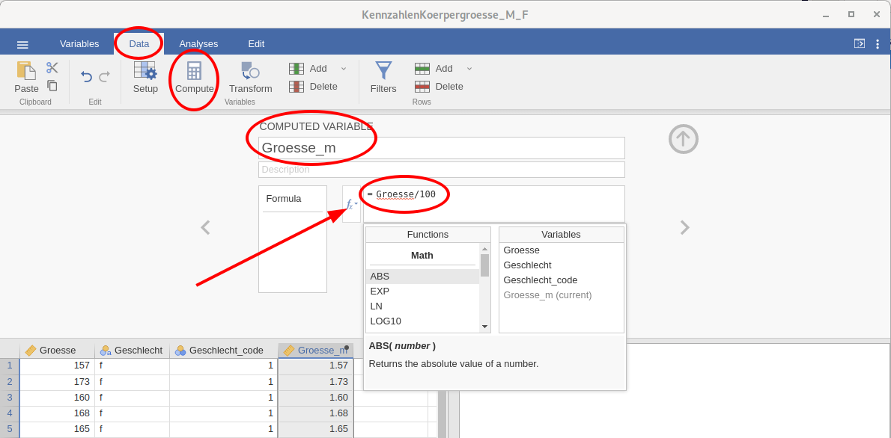{fig-align="center" width=100%}

### Transformieren - Zum Beispiel bilden von Kategorien

- Man will z.B. eine kontinuierliche Skala kategorisieren. Für die Körpergrösse z.B. die Klassen `klein`, `mittel` und `gross`.
- Data > Transform klicken. Quellvariable angeben, eine Transformation anlegen.

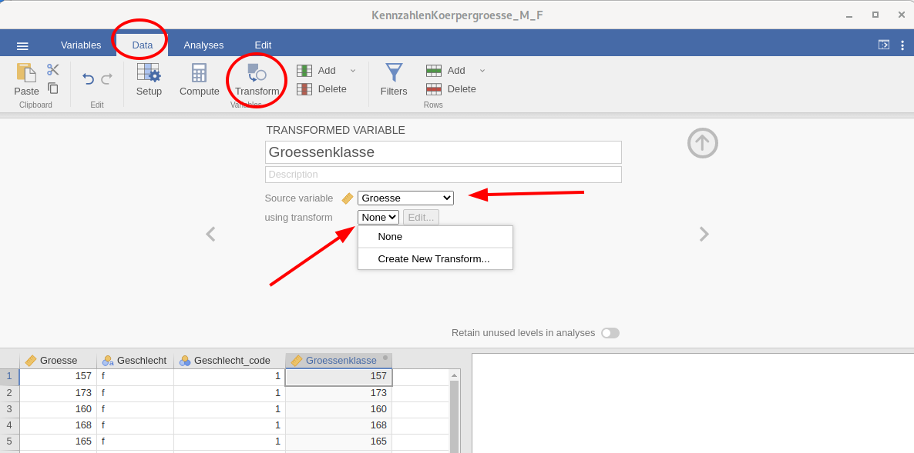{fig-align="center" width=100%}

- Vorteil Arbeiten mit Transformationen: man kann diese wiederholt auf andere Variablen anwenden.
- Hat man eine Transformation angelegt, kann man Rekodierungskonditionen hinzufügen.

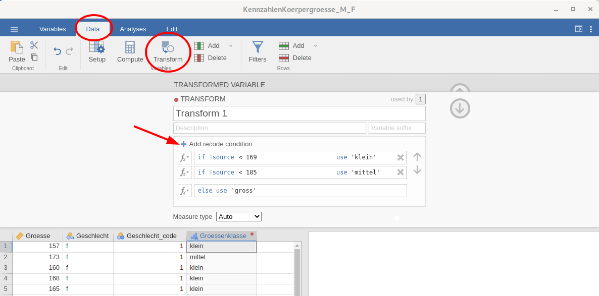{fig-align="center" width=100%}

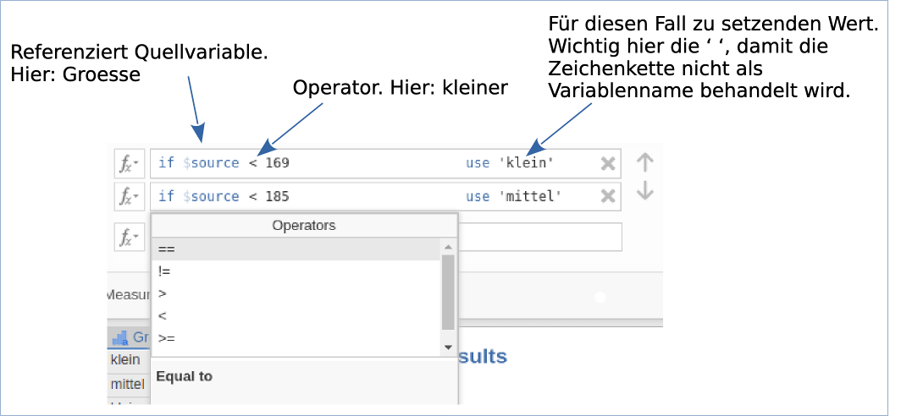{fig-align="center" width=100%}

### Filtern - Teilmengen (Zeilen) auswählen

Beispiel: Daten aller weiblichen Personen `Geschlecht == 'f'`

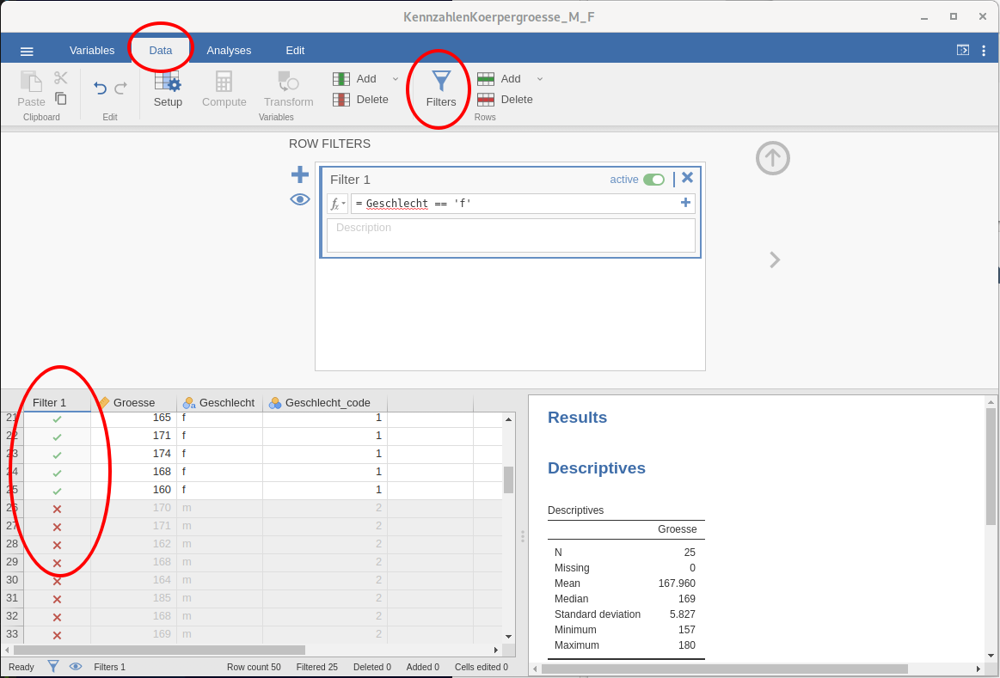{fig-align="center" width=100%}

Beispiel: Daten aller **nicht** weiblichen Personen `Geschlecht != 'f'`

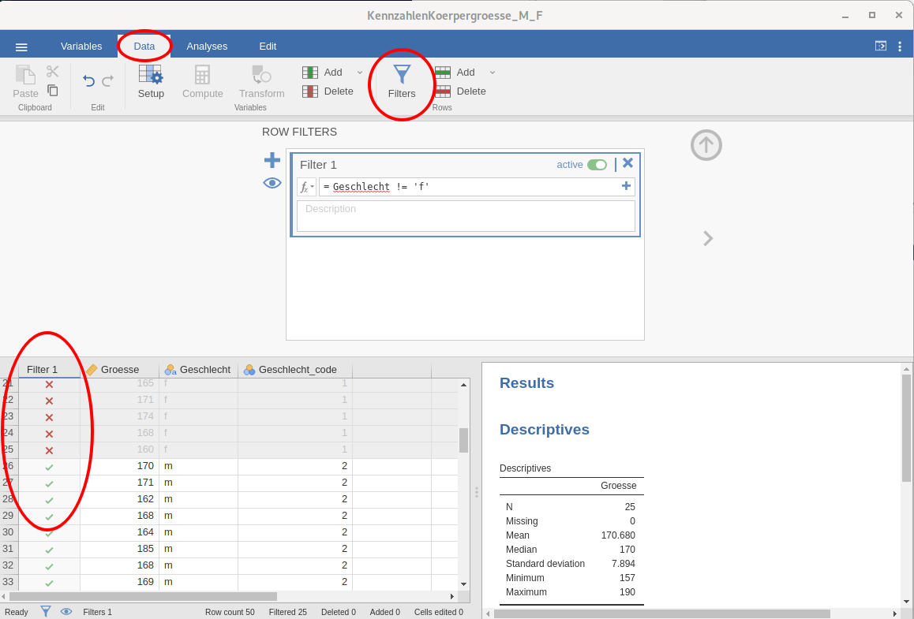{fig-align="center" width=100%}

#### Vergleichende Operationen mit Komparatoren

| Komparator | Bedeutung               |
|------------|-------------------------|
| `==`       | ist gleich              |
| `!=`       | ist ungleich            |
| `>`        | ist grösser             |
| `<`        | ist kleiner             |
| `>=`       | ist grösser oder gleich |
| `<=`       | ist kleiner oder gleich |

| Beispiel            | Bedeutung                                                |
|---------------------|----------------------------------------------------------|
| `Geschlecht == 'f'` | Variable `Geschlecht` hat Wert `f`                       |
| `Geschlecht == f`   | Variable `Geschlecht`  hat Wert der Variablen `f`        |
| `Groesse > 169`     | Wert der Variablen `Groesse` ist grösser als 169         |
| `Groesse >= 169`    | Wert der Variablen `Groesse` ist grösser oder gleich 169 |

### Verknüpfte Filter: UND - Variante 1: Verschachtelte Kondition

::: {.callout-tip title="Beispiel"}
Daten aller weiblichen Personen grösser 1.69 m

```
Geschlecht == 'f' and Groesse > 169
```
:::

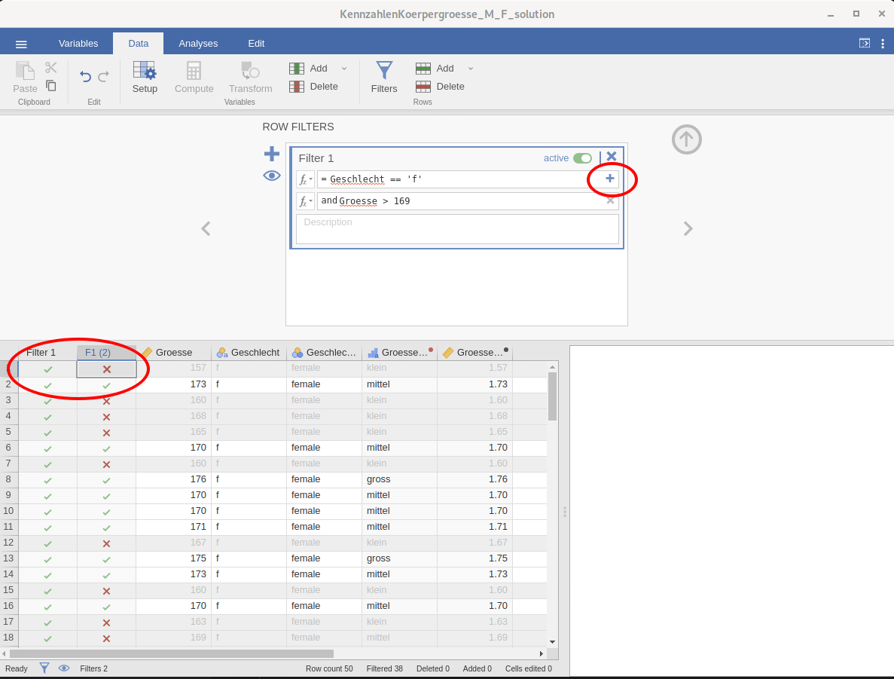{fig-align="center" width=100%}

### Verknüpfte Filter: UND - Variante 2: Textverknüpfung

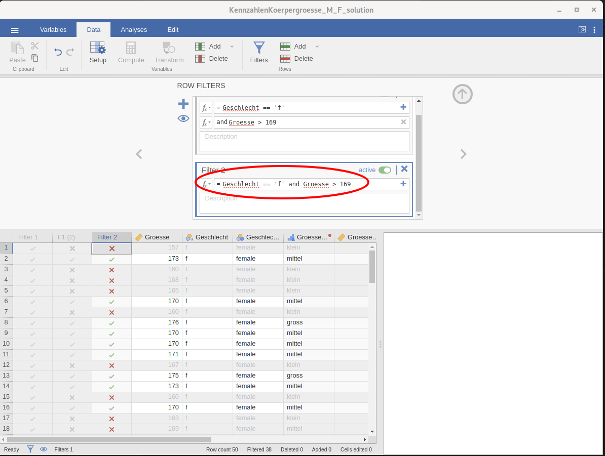{fig-align="center" width=100%}

### Verknüpfte Filter: UND - Variante 3: Separate Filter

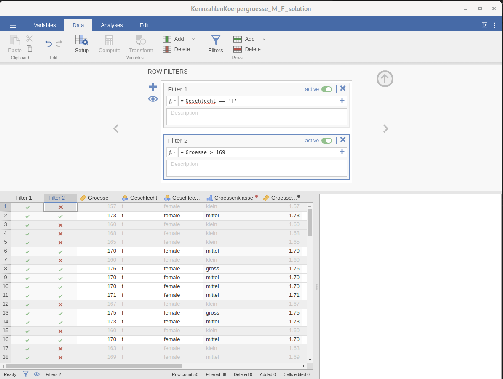{fig-align="center" width=100%}

### Verknüpfte Filter: ODER

::: {.callout-tip title="Beispiel"}
Alle Personen der Kategorie `klein` oder `gross`

```
Groessenklasse == 'klein' or Groessenklasse == 'gross'
```
:::

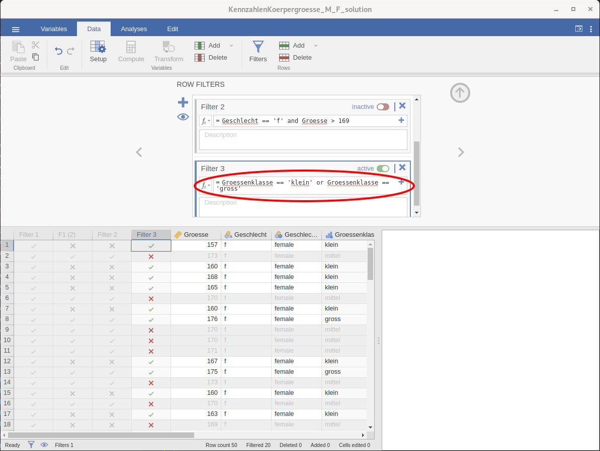{fig-align="center" width=100%}

### Aufgabe 3

::: {.panel-tabset}

### Aufgabe

Benutze den Datensatz <a href="../data/KennzahlenKoerpergroesse_M_F.csv" download>KennzahlenKoerpergroesse.csv</a>

Finde dich in jamovi zurecht und reproduziere die in den vorherigen Abschnitten gezeigten Schritte zum Codieren, Berechnen und Transformieren von Variablen und zum Filtern von Teilmengen des Datensatzes.

### Lösung

<a href="../solutions/BSc_WS1_IntroJ_Ex3_sol.omv" download>BSc_WS1_IntroJ_Ex3_sol.omv</a>

### Codebook

- `Groesse`: Körpergrösse in cm
- `Geschlecht`: Geschlecht (f = female, m = male)
- `Groessenklasse`: Grössenklasse (klein, mittel, gross)

:::

### Aufgabe 4

::: {.panel-tabset}

### Aufgabe

- Lade die Datei <a href="../data/NHANES-BW-BH.csv" download>NHANES-BW-BH.csv</a>
- Importiere den Datensatz in jamovi. Stelle sicher, dass Körpergrösse und Körpergewicht das Skalenniveau `Kontinuierlich` und das Geschlecht das Skalenniveau `Nominal` haben.
- Recodiere die Variable `Geschlecht` in f (weiblich) und m (männlich).
- Berechne den Body Mass Index (BMI) als neue Variable mit $\text{BMI}=\frac{\text{Körpergewicht}}{\text{Körpergrösse}^2}$. Dazu ist in jamovi *Data > Compute* zu verwenden.
- Kreiere eine neue Variable `BMIcat`, welche den BMI in Untergewicht, Normalgewicht (BMI 20 bis 25) und Übergewicht kategorisiert. Benutze dazu in jamovi *Data > Transformation*.
- Berechne mit Hilfe eines Filters eine deskriptive Statistik für alle weiblichen Personen mit Normalgewicht.

### Lösung

<a href="../solutions/BSc_WS1_IntroJ_Ex4_sol.omv" download>BSc_WS1_IntroJ_Ex4_sol.omv</a>

### Codebook

- `Koerpergroesse`: Körpergrösse in cm
- `Koerpergewicht`: Körpergewicht in kg
- `Geschlecht`: Geschlecht (1 = male, 2 = female)

Datenquelle: [NHANES 2015-2016](https://wwwn.cdc.gov/nchs/nhanes/continuousnhanes/overview.aspx?BeginYear=2015)

:::
